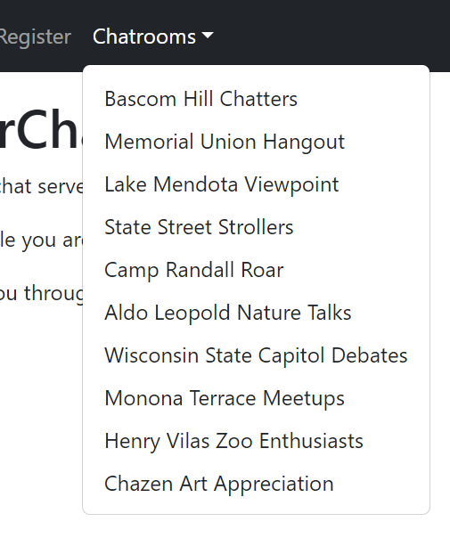
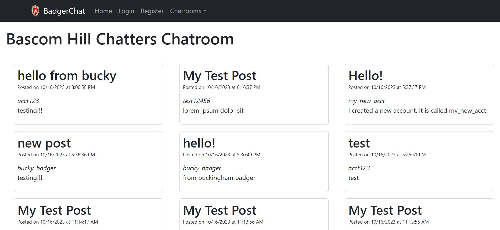
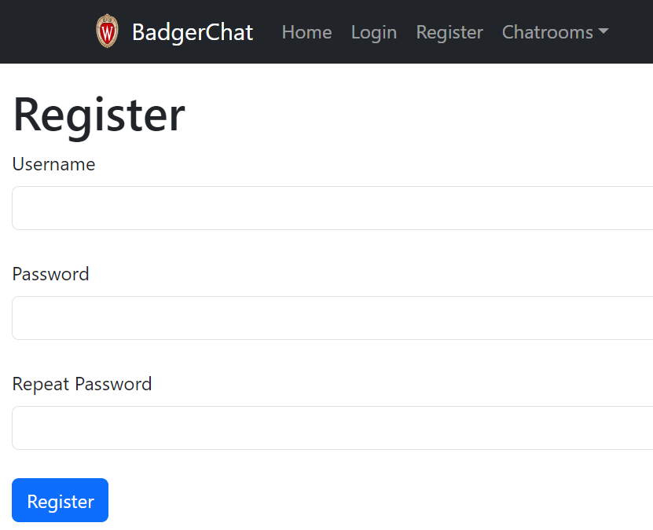
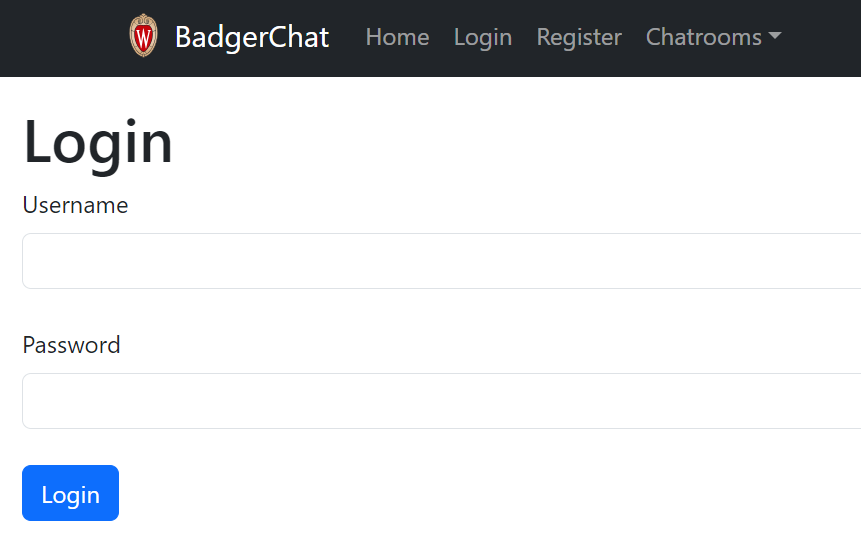
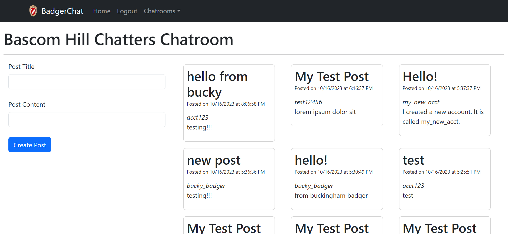
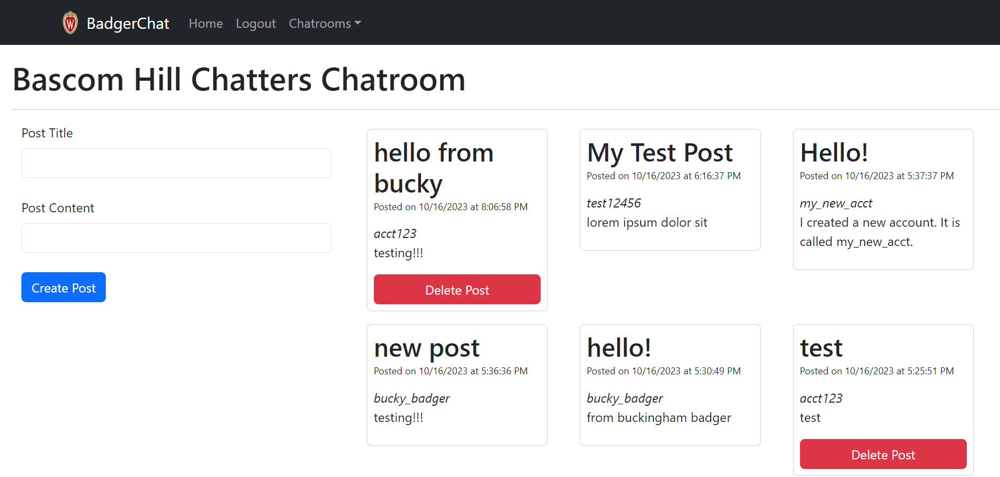

# BadgerChat: Real-Time Messaging Platform

Welcome to BadgerChat! This platform is a dynamic real-time messaging web application designed for seamless communication among users. Dive into an interactive environment where you can connect, share, and engage with others in various dedicated chatrooms. Here's what you can expect when you use BadgerChat:

## Key Features

### Interactive Chatrooms
- **Multiple Chatrooms**: Access a variety of chatrooms, each providing a unique space for discussions and interactions.

- **Real-Time Messaging**: Send and receive messages instantly with other participants within any chatroom.


### Robust User System
- **User Registration**: Sign up to participate in chatrooms by creating a unique username and password.

- **User Login/Logout**: Securely log in to access your account and log out when needed.

- **User Authentication**: Your credentials are handled securely, ensuring that your login process is safe and private.

### Advanced Messaging Capabilities
- **Post Messages**: Share your thoughts and ideas by posting messages in the chatrooms.

- **Delete Messages**: Retain control over your content with the ability to delete your own messages.


### Navigation and Accessibility
- **Easy Navigation**: Utilize links and navigation dropdowns to smoothly move across different sections and chatrooms.
- **Accessibility Features**: Each input control is properly labeled to ensure the platform is accessible to all users.

### Responsive Design
- **Mobile-Friendly Interface**: Enjoy a consistent experience across all devices thanks to a responsive design that adjusts to different screen sizes.

## Technical Setup

The platform is built using modern web technologies including React, Bootstrap, and React Router for a responsive and intuitive user interface. Data interactions are handled through a dedicated API, allowing for real-time communication and updates.

### Getting Started
To start using BadgerChat, follow these simple steps:
1. Clone the repository and navigate to the project directory.
2. Install dependencies using:
   ```bash
   npm install
